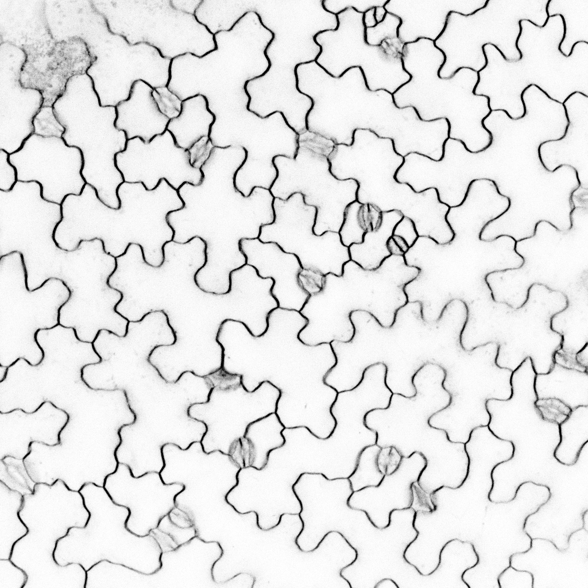
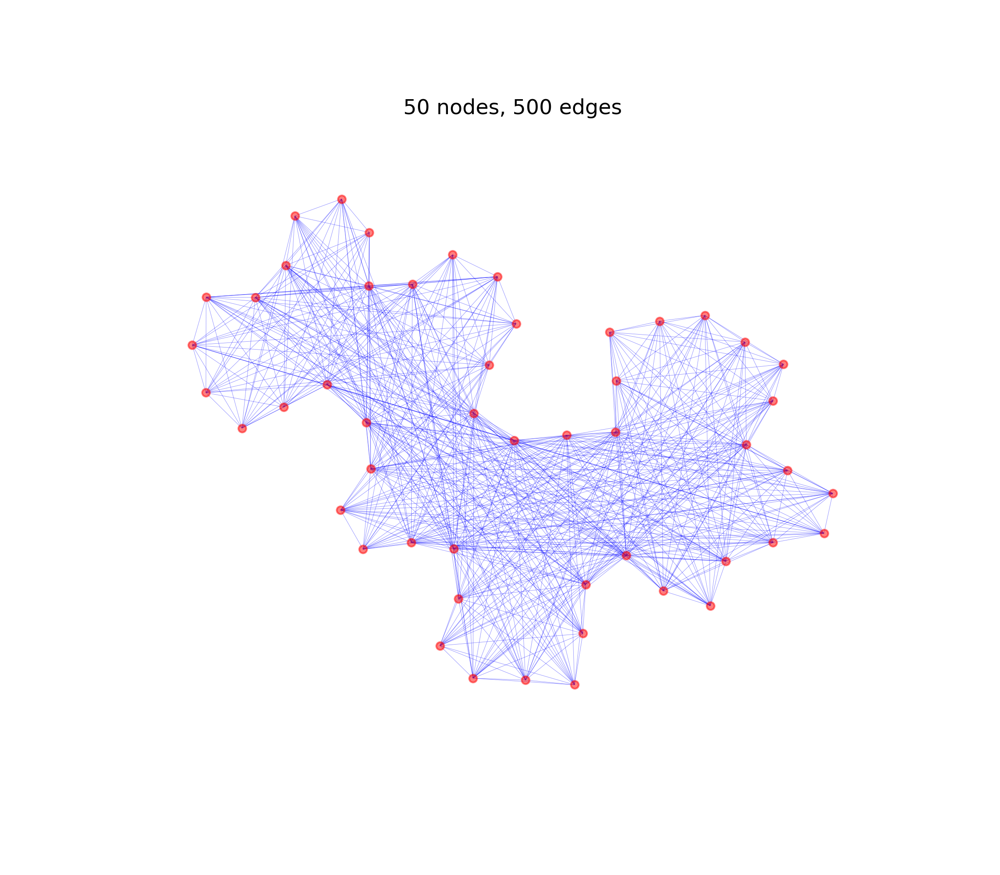
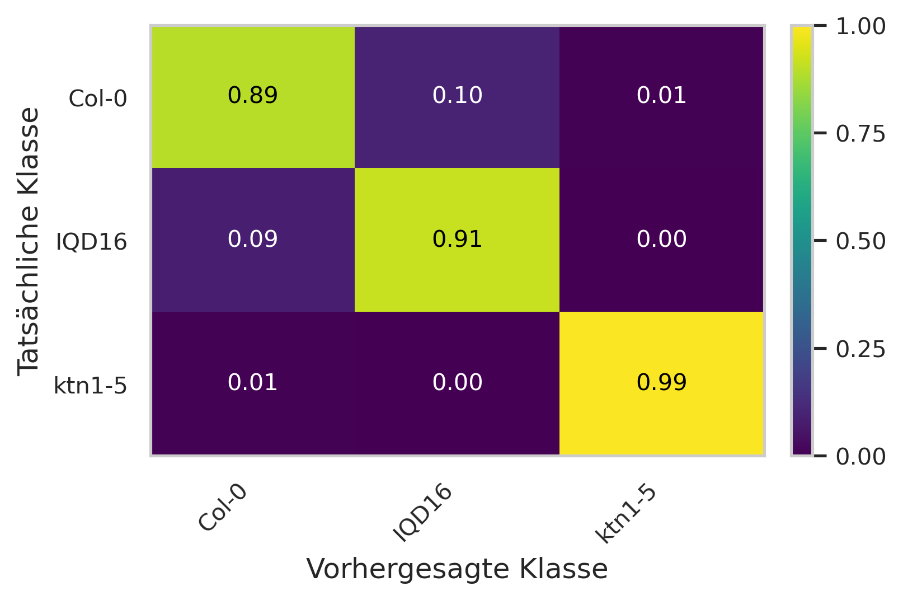
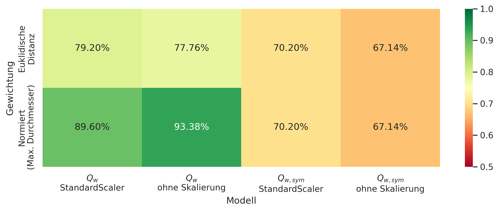
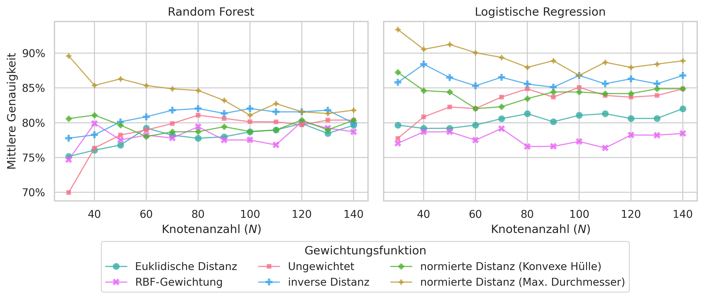
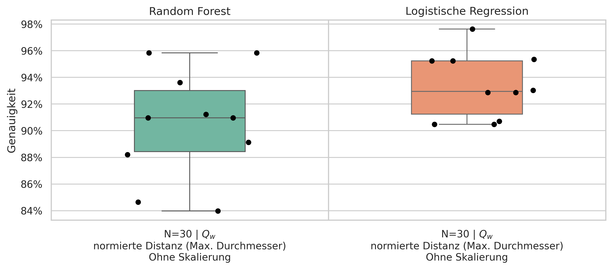

# Spectral Graph Descriptors for Cell Shape Analysis

> Bachelor Thesis Project   
> Python framework for graph-based feature extraction and statistical analysis of microscopic cell structures using spectral graph theory.

[](https://www.python.org/downloads/)
[]()
[]()

---

## Project Overview

This repository contains the implementation developed for the Bachelor's thesis:

**"Spektrale Graph-Deskriptoren zur Formanalyse von Zellen"**
("Spectral Graph Descriptors for the Shape-Analysis of Cells")

The project investigates how complex biological cell morphologies can be represented and compared using graph-based methods.  
Cell contours are transformed into visibility graphs, whose Laplacian spectra are used to derive mathematical shape descriptors for statistical analysis and classification tasks.

The framework combines:
- graph-theoretical modeling
- spectral analysis
- feature extraction
- statistical evaluation
- machine learning workflows

---

## Visual Workflow

| Input Cell ROI | Extracted Single Cell Contour | Visibility Graph | Evaluation of Classification  (Confusion Matrix) | Ablation Study |
|:---:|:---:|:---:|:---:|:---:|
|  |  |  |  |  |


---

## Methodology

The analysis pipeline consists of four main stages:

```text
Microscopic Cell Images (.lsm)
        ↓
Contour Extraction
        ↓
Visibility Graph Construction
        ↓
Laplacian Spectrum Computation
        ↓
Feature Extraction
        ↓
Statistical Analysis / Classification
```

### Graph Representation

Cell contours are converted into visibility graphs, where contour points are represented as graph nodes and visibility relations define graph edges.

### Spectral Descriptors

The eigenvalue spectrum of the graph Laplacian is used as a compact mathematical descriptor of morphological properties such as:
- protrusions
- symmetry
- structural complexity
- contour irregularity

### Statistical Evaluation

The extracted spectral descriptors were evaluated in supervised classification experiments using:
- Logistic Regression
- Random Forest

Model performance was assessed using:
- confusion matrices
- classification accuracy

Grid Search & Ablation Studies: 
- Using a systematic grid search (experiment_grid_runner.py), various modeling strategies and hyperparameter configurations were tested against each other. This included ablation studies to evaluate the impact of different spectral feature subsets and graph construction methods on classification performance, ensuring an optimized and interpretable feature set.

Additionally, feature importance analysis was performed to identify which spectral descriptors contributed most strongly to the discrimination of different cell morphologies.

---

## Software Architecture

The project is structured as a modular analysis pipeline with clear separation between:
- data loading
- graph construction
- descriptor computation
- visualization
- statistical evaluation

### Design Characteristics

- modular pipeline architecture based on the Strategy Pattern
- interchangeable processing strategies for data loading, graph construction, and statistical analysis
- configurable computation and evaluation workflows
- batch-processing support for microscopy datasets
- reproducible experiment configuration via centralized config files

This design allows individual pipeline components to be replaced or extended independently without modifying the overall workflow structure.

### Supported Input Formats

Implemented reader strategies support:
- ROI files
- JPEG images
- serialized graph objects (`gpickle`)

---

## Repository Structure

```text
assets/                                     README visualizations and example outputs

scripts/
├── main.py                                 Main project entry point
├── experiment_grid_runner.py               Grid search and experiment execution
└── configs/                                Experiment and pipeline configurations

spectral_graph_metric_pavement_cells/
├── core/                                   Core pipeline abstractions and runtime logic
│   ├── features/                           Spectral descriptor computation
│   ├── interfaces/                         Shared pipeline interfaces
│   ├── pipelines/                          Pipeline orchestration
│   ├── results/                            Result representations
│   └── runtime/                            Runtime execution components
│
├── strategies/                             Modular strategy-based processing components
│   ├── analysis/                           Classification and statistical evaluation
│   ├── distances/                          Distance and similarity measures
│   ├── filters/                            Filtering and preprocessing strategies
│   ├── graphs/                             Visibility graph construction strategies
│   ├── persistence/                        Persistence-workflow
│   ├── prediction/                         Prediction and Inference workflow
│   └── readers/                            Input data reader strategies
│
├── utils/                                  Mathematical and geometric helper utilities
└── visualization/                          Visualization and evaluation plots

environment.yml                             Reproducible project environment
README.md                                   Project documentation
```

---
## Installation

### Clone Repository

```bash
git clone https://github.com/bj-vogl/spectral-graph-descriptors.git
cd spectral-graph-descriptors
```

### Create Environment
For a reproducible environment, it's recommended to use _micromamba_ or _conda_. Use the [environment.yml](environment.yml) file to create an environment:
```bash
# 1) Python environment with micromamba
micromamba create -f environment.yml
micromamba activate SpectralGraphDescriptors
```
or
```bash
# 2) Python environment with conda
conda env create -f environment.yml
conda activate SpectralGraphDescriptors
```

## **Run the Project**
To ensure that local modules are found, add the project root to your PYTHONPATH (run this from the repository root):
```bash
export PYTHONPATH=$PYTHONPATH:$(pwd)
```
In the active environment, run the project directly with a Python config file from the repo root:
```bash
python scripts/main.py --config scripts/configs/<config_name>.py
```
If no config file is specified, the default batch configuration is loaded automatically.

---

## Configuration System

Configuration files are located under:

```text
scripts/configs/
```

They define:
- data sources
- graph construction strategies
- feature extraction settings
- visualization parameters
- machine learning workflows
- classifier selection

### Example Configurations

#### `example_config_single.py`

- computes visibility graphs and feature vectors
- visualizes contours and graphs
- performs no classification

#### `example_config_batch.py`

- processes grouped datasets
- performs classification using:
  - Logistic Regression
  - Random Forest
- generates:
  - confusion matrices
  - statistical summaries
  - batch evaluation outputs

---

## Results

Generated outputs are written to:

```text
data/results/<config_name>/
```

This includes:
- visibility graph visualizations
- spectral descriptor outputs
- classification summaries
- confusion matrices
- grid search evaluations

Example evaluation outputs:

| Line-plots | Box-plots |
|:---:|:---:|
|  |  |

---

## Tech Stack

### Core
- Python 3.13

### Scientific Computing
- NumPy
- SciPy
- Pandas

### Graph Processing
- NetworkX

### Machine Learning
- Scikit-learn

### Visualization
- Matplotlib
